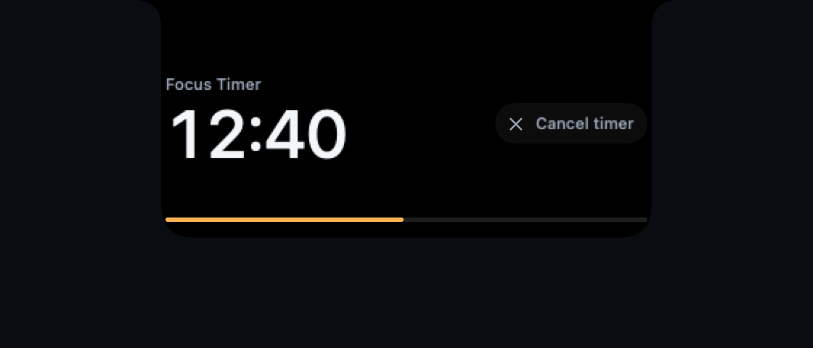
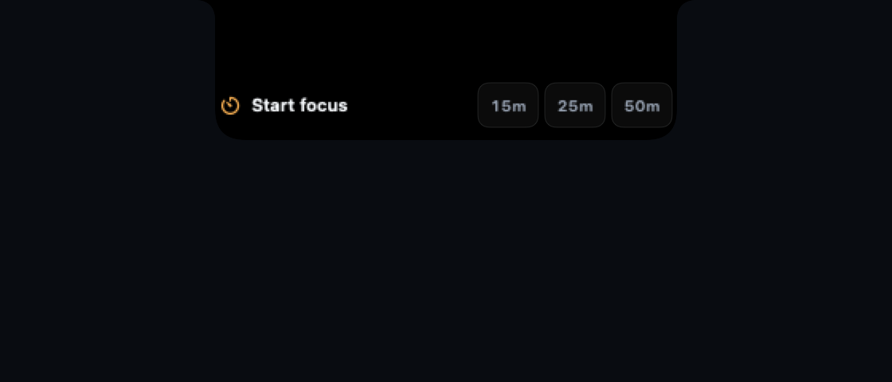
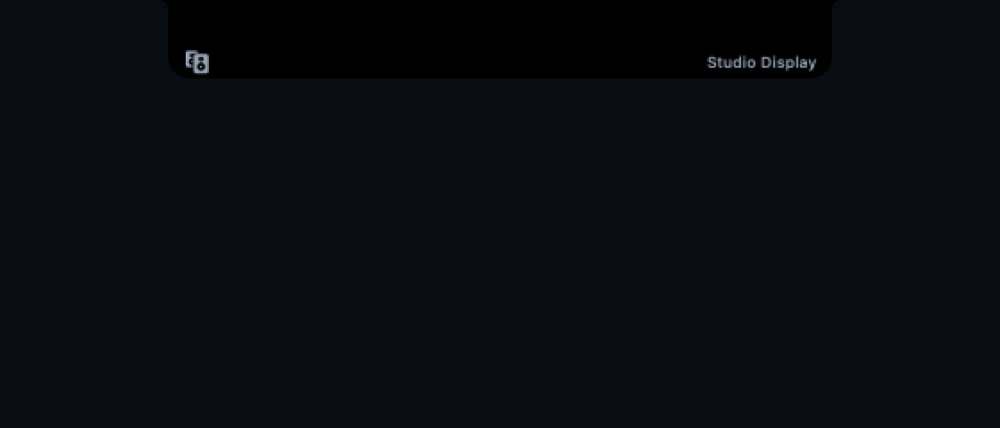

<div align="center">

# Erylo

### On cue. Out of view.

Erylo turns the quiet space around your MacBook's notch into a useful part of
your day—present when it matters, invisible when it does not.

Today it is deliberately narrow: a Focus Timer, plus optional event-driven
Battery and Volume acknowledgements. The broader activity layer is groundwork,
not a claim that the planned utilities already ship.



<sub>The production SwiftUI Focus Timer rendered by Erylo's deterministic native macOS harness.</sub>

<p>
  
  
  
  
</p>

</div>

---

## A timer should not need another window

Deliberately open idle Erylo and choose a 15, 25, or 50 minute Focus Timer from
the compact launcher, or use the same presets in the Erylo menu. Its progress
lives at the top edge of the display, where it can be checked without opening
an app, moving a window, or breaking concentration.

The running timer stays compact on hover because a larger duplicate adds no
value. Click it or press <kbd>Control</kbd> + <kbd>Option</kbd> +
<kbd>Command</kbd> + <kbd>E</kbd> for the expanded controls. Cancel there or
directly from the menu. When the session ends, Erylo briefly opens a readable
**Focus complete** acknowledgement, then disappears.

The session is stored as one absolute deadline, so quitting and reopening Erylo
restores the same timer instead of restarting or silently losing it. Expired or
invalid records restore no work and never produce a late completion sound.

<p align="center">
  
</p>

<p align="center">
  
  <br>
  <sub>Compact enough to glance at. Quiet enough to forget about.</sub>
</p>

## One small rhythm

<table>
  <tr>
    <td width="33%" valign="top">
      <strong>1 · Start</strong><br><br>
      Choose a focus length from the compact native launcher or Erylo menu.
      Starting again cleanly replaces the current session.
    </td>
    <td width="33%" valign="top">
      <strong>2 · Glance</strong><br><br>
      See the remaining time and live progress in a slim silhouette joined to
      the notch—not in a floating dashboard.
    </td>
    <td width="33%" valign="top">
      <strong>3 · Act</strong><br><br>
      Open Erylo when you need context, cancel from the notch or menu, then let
      the surface settle away.
    </td>
  </tr>
</table>

## Why Erylo feels different

<table>
  <tr>
    <td width="50%" valign="top">
      <strong>Attached, not overlaid</strong><br>
      The shape grows from the top edge and visually belongs to the notch. It is
      not a card hovering below it.
    </td>
    <td width="50%" valign="top">
      <strong>Calm by default</strong><br>
      No idle animation or permanent dashboard. Hover reveals a short,
      non-activating Peek only when an activity has useful additional detail;
      full expansion waits for a click or shortcut.
    </td>
  </tr>
  <tr>
    <td width="50%" valign="top">
      <strong>Useful without stealing focus</strong><br>
      The activity surface is non-activating and supports a global shortcut,
      menu commands, and VoiceOver-friendly actions.
    </td>
    <td width="50%" valign="top">
      <strong>Designed for the whole Mac</strong><br>
      Erylo is built for notched and non-notched displays, multiple displays,
      Spaces, sleep, wake, and the system's Reduce Motion setting. The complete
      hardware matrix remains a release gate.
    </td>
  </tr>
</table>

> **Local first, by design.** Erylo has no analytics SDK, automatic diagnostics
> upload, media history, or background polling just to keep the surface alive.
> Browsing Settings starts no utility, permission request, socket, file access,
> media automation, or network work.

## Available today

### Focus Timer

- Start a **15, 25, or 50 minute** session from the idle notch launcher or Erylo menu.
- Follow useful `MM:SS` or `H:MM:SS` remaining time and live progress from the compact notch surface.
- Expand for context and a clear **Cancel timer** action.
- Cancel from the menu when keyboard or VoiceOver navigation is preferable.
- Replace a running session safely by starting another preset.
- Quit and relaunch without losing the active deadline or creating background ticks.
- Let a short **Focus complete** acknowledgement disappear without leaving timer work or ownership behind.

### Battery and charging

- Enable it explicitly in Settings; persisted enablement restores at app startup
  without a permission prompt.
- Keep an ordinary first reading quiet, briefly acknowledge later power changes,
  and retain an ambient warning only while an unplugged battery is at or below 20%.
- Use local IOPowerSources notifications with no polling or network work.
- Stay fully click-through: passive power acknowledgements never become dead controls.

### Volume

- Enable it explicitly in Settings; it needs no permission or network access.
- Get row-local confirmation after an explicit enable; persisted launch restore
  remains quiet.
- Treat the current default-output state at enable/restore as a quiet baseline,
  then show later level changes as a percentage, mute as **Muted**, unmute as
  **Sound on**, and an output switch as the bounded device name or **Audio output**.
- Use CoreAudio property listeners and cancellable 1.8-second presentations, not
  polling or a permanent HUD.
- Stay fully click-through while passive, so a transient cue cannot swallow a menu-bar click.
- Keep output names transient: they are not persisted, logged, diagnosed, or exported.
- Let the short Volume acknowledgement temporarily outrank a Focus Timer, then
  restore the exact same timer and working Cancel action when it expires.

<p align="center">
  
  <br>
  
</p>

These are the complete live utilities today. The screenshots show native
production-surface renders; Battery and Volume still require the manual hardware
validation listed in the compatibility matrix before a signed release. Because
none of these three utilities needs protected-data access or app automation, the
production bundle declares no privacy usage descriptions and requests no
capability entitlement.

## What Erylo is growing into

The activity foundation already anticipates more small, time-sensitive moments.
These utilities are planned, but they are **not connected to the app and do not
run in the background**:

| Next utility | The moment it should simplify |
| --- | --- |
| **Now Playing** | See and control Apple Music or Spotify without leaving the current task. |
| **Meetings** | Notice an upcoming meeting only when it becomes relevant. |
| **File Hold** | Keep one file close while moving between tasks. |
| **External activities** | Let trusted local tools show and dismiss their own progress. |

## Run Erylo

Erylo currently ships source-first. You need macOS 14 or newer and Swift 6
Command Line Tools.

```sh
git clone https://github.com/eduardtomas1/Erylo.git
cd Erylo
swift run Erylo
```

Look for Erylo's top-edge signal mark in the menu bar. From there you can start
or cancel a Focus Timer, show or hide the surface, open Settings to enable
Battery or Volume, check for updates when a signed feed is configured, or quit
cleanly.

> Erylo does not publish a signed end-user download yet. The release pipeline is
> in place, but real Developer ID signing, notarization, and update publication
> remain explicit release gates.

<details>
<summary><strong>Building, testing, or contributing?</strong></summary>

The product README stays intentionally human. The deeper material lives here:

- [Development guide](docs/DEVELOPMENT.md)
- [Product design system](docs/DESIGN_SYSTEM.md)
- [Architecture notes](docs/FOUNDATION.md)
- [Glance provider lifecycle](docs/GLANCE_LIFECYCLE.md)
- [Compatibility and hardware gates](docs/COMPATIBILITY_MATRIX.md)
- [Release runbook](docs/RELEASE_RUNBOOK.md)
- [Contribution guide](CONTRIBUTING.md)
- [Security policy](SECURITY.md)

</details>

---

<div align="center">

**On cue. Out of view.**

Erylo is open source under the [Apache License 2.0](LICENSE).

</div>
